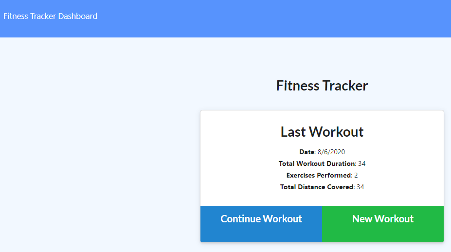
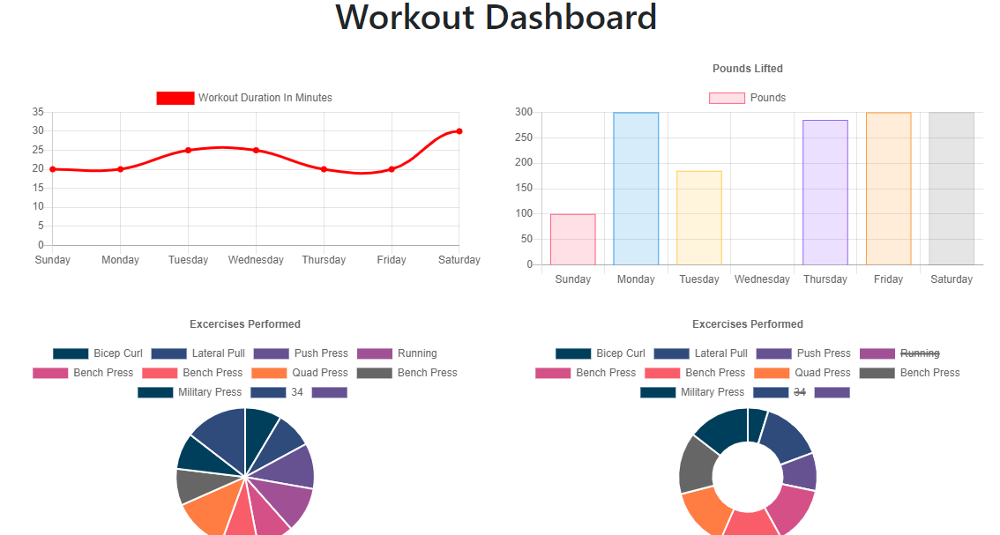

https://workout-tracker-tober65.herokuapp.com/

# Workout Tracker

## Description 
A workout tracking app that will store workouts in a database and display them in charts.

## Table of Contents 
[Installation](#installation)

[Usage](#usage)

[License](#license)

[Contributing](#contributing)

[Tests](#tests)

[Questions](#questions)
## Installation
Download the source code, then in the folder with script.js run "npm install". 

## Usage
In the folder with server.js run "npm start". Add workouts in the fitness trackers page, and view them on the dashboard page.

## License
This is licensed under the [MIT license](https://choosealicense.com/licenses/mit/).

## Contributing
Feel free to contribute

## Tests
No tests at the moment

## Questions
GitHub: https://github.com/tober65
Email: timothy.ober@gmail.com